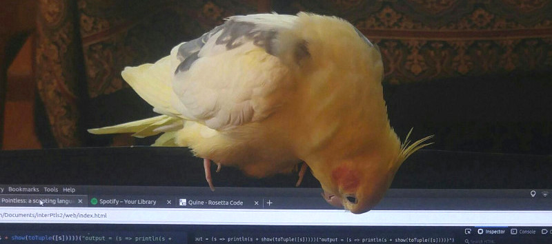

As I write this in **March 2026**, AI has played a very limited role in the
design and development of the Pointless language, its documentation, and its
website. In this document I'll describe the ways in which this may change, and
the ways in which it will not.

I've been working on this project for around 8 years now; making engineering
mistakes, applying my knowledge of algorithms to a variety of tricky problems,
writing some pretty clever code, and going through many, many iterations of
prototyping, testing, and revision. I love software development, and I consider
this project to be a testament to my creativity and skill as a software
engineer, built through 8 years of hard, human work.

In the process, I've built a language that I am very proud of, and that I think
has real-world potential, particularly as an educational tool. As such, I'm
starting to think about how to better document, test, and publicize what I've
built. I think that generative AI could be helpful in this next phase of work.

## How I have used AI so far

As of March 2026, essentially all of the code in this project has been designed
and written by hand, with the exception being very small code snippets (things
like _"write a function to escape an HTML string in JS"_). Currently, there are
fewer than 100 lines of AI-generated code in this project across the core
language code, standard library implementation, documentation, tooling, and
website. Any AI-generated code that is currently present was not added using
agentic AI, but was instead manually reviewed and incorporated into the project.

I myself started using AI regularly about a year ago, slowly incorporating it
into my work. Over the past six months, when working on this project, I've used
generative AI to help me improve as a software developer, understand APIs and
specifications of existing software, and get feedback on design decisions.
Examples of questions I've asked AI include:

- What is the difference between `AbortController` and `AbortSignal`?
- What are valid characters in an ISO 8601 string?
- Why does `{}[print("a")] = print("b")` print `"b"` before `"a"` in Python?
- Are there any languages that include a `break` keyword for loops but not a
  `continue` keyword? _(Lua)_
- Which of these standard library functions (...) should be globals?
- I'm writing a standard library function that does (...), what should I name
  it?

I've also used AI to get feedback on some larger design choices, with questions
like:

> I'm thinking of allowing the `arg` keyword before a field name to be omitted
> and inserted implicitly by the parser, which would let me write code like this
> `cities $ .population > 100000` as a shorthand for
> `cities $ arg.population > 100000`. Is this a good idea?

## How I plan to use AI going forward

- I won't use AI to generate any person-to-person communications (emails,
  comments, etc).

- I won't use AI-generated images anywhere in this project (or anywhere else,
  for that matter). I may use AI to generate SVG diagrams if it ever becomes
  good at that.

- I won't use AI to generate any
  [articles or tutorials](https://pointless.dev/articles/) on the language
  website. I may use AI to help me scaffold my writing: for example, if I have a
  list of topics I want to cover I might ask AI for suggestions on the best
  order in which to cover them.

- I won't use AI to write any of the core language code (the code in
  [pointless/lang](https://github.com/pointless-lang/pointless/tree/main/lang)).
  I know this code like the back of my hand and I want it to stay this way. If I
  ever decide to overhaul the language implementation (have it compile to WASM,
  say) then I might revisit this decision.

- I may use AI to generate code for language-related tooling (the language REPL
  has been a particular headache that I'd love to get some help with).

- I may use AI to help generate the HTML, CSS, and JS code for the langauge
  website.

- I will use AI to help write a (long overdue) test suite for the language.

- I will continue to use AI to get feedback when making language design
  decisions.

- I will use AI to help tighten up the written descriptions for
  [standard library](https://pointless.dev/stdlib/) functions. I may use also AI
  (along with careful human review and editing) to help generate new
  documentation for standard library functions. I've found that AI is very good
  at writing clear and concise specifications.

- The question of [language documentation](https://pointless.dev/language/) is a
  little tricky, since it sits somewhere between a specification and a tutorial.
  I won't use AI to generate language documentation from scratch, but I may use
  it to clean up or round out draft content that I've written.

- I will use AI to lint my code and proofread my writing.

- I will continue to ask AI what to name standard library functions. It is the
  [hardest problem](https://martinfowler.com/bliki/TwoHardThings.html) in
  computer science, after all.
